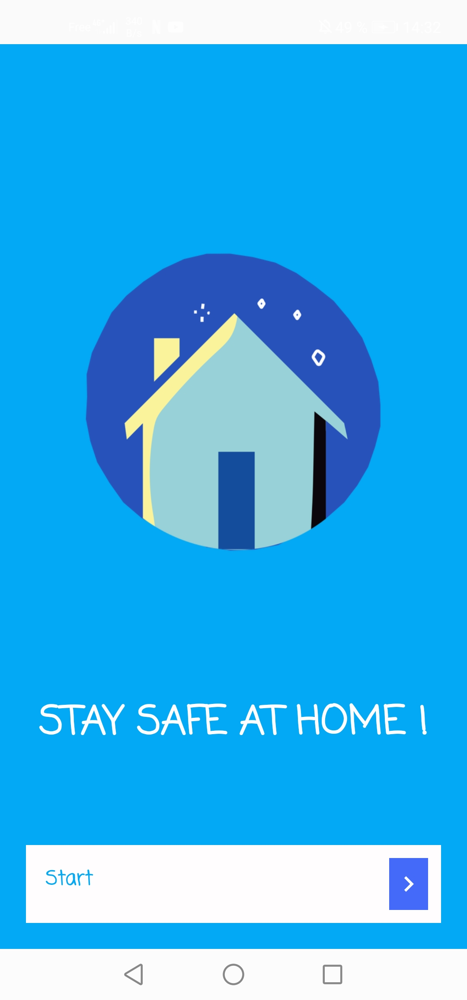

# Confined

## Présentation du projet

Confined est une application android pour les personnes confinées pendant la pandémie de Covid-19. 
Elle permet aux utilisateurs de collecter différentes données concernant le Covid-19 à travers les pays touchés par la pandémie.
Elle fournit aussi un générateur d'activités aléatoires pour les confinés sombrant dans l'ennui.

## Utilisation

* Architecture MVC
* Singleton
* Appels Web Service à une Api REST pour alimenter la liste RecyclerView
* Utilisation de Picasso pour récupérer les drapeaux des pays pour RecyclerView.
* Stockage de la liste Json en données caches
* RecyclerView pour l'affichage de la liste
* Outils de filtrage (recherche) RecyclerView avec SearchView
* Menu principal avec ToolBar et NavigationView accès grâce au bouton menu ou par swipe vers la droite.
* Utilisation 6 activity (écran de démarrage,écran pricipal, deuxième activity: liste des pays infectés, troisième activity: détails du pays infecté, quatrième activity: générateur d'activités aléatoires, cinquième activity: More Info)

## Design 

Écran de demarrage de l'application:

Page d'accueil (ou Home) avec le bouton Menu en haut à gauche et l'affichage du numéro d'infectés, de guéris et de décès dans le monde récupéré par un appel vers l'API:

Affichage du menu donnant accès aux différentes activity:

List of Countries Infected :

Détails d'un pays infectés :

Possibilité de lancer une recherche, en entrant les lettres du pays que l'on recherche dans la liste :

To Fight Boredom (générateur d'activités aléatoires à faire pendant le confinement):

More info (lien vers un site donnant plus d'informations concernant le Covid-19, notamment les nouvelles actualités):

